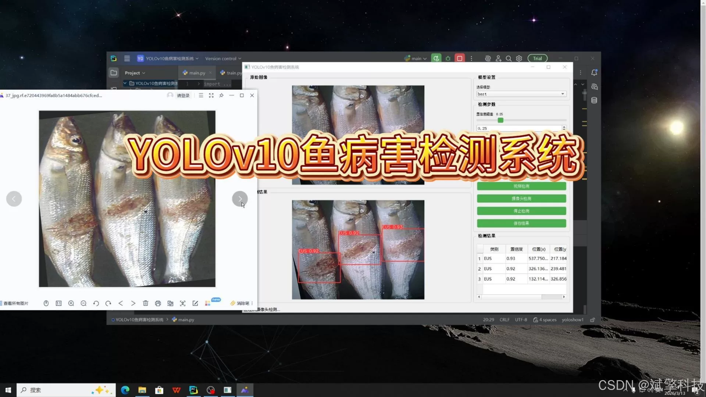
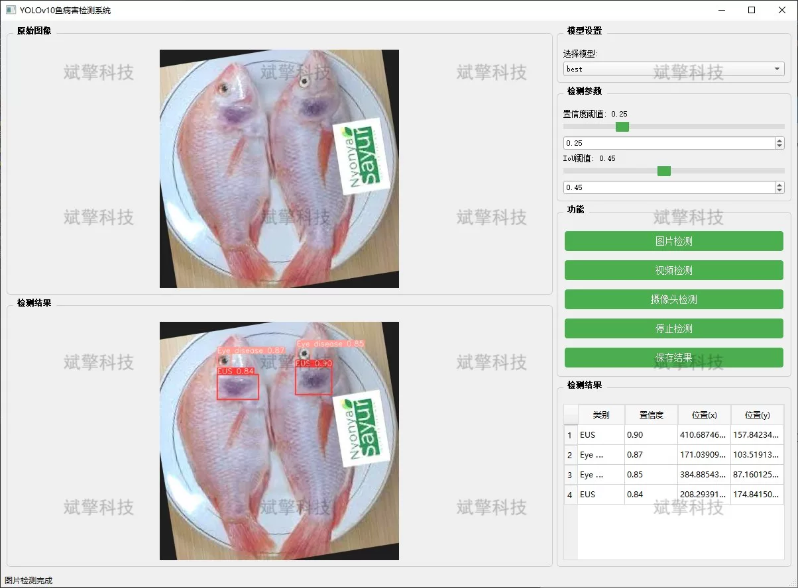
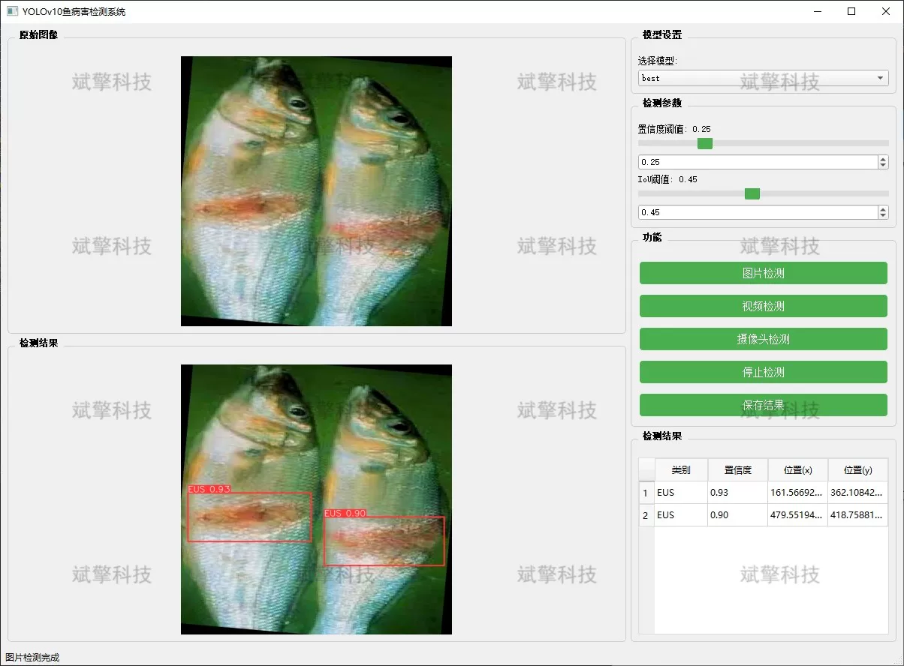

# YOLOv10 fish disease detection system

## Body

YOLOv10 Fish Disease Detection System Based on YOLOv10 Deep Learning for Fish Disease Detection (YOLOv10+YOLO dataset + UI interface + Python project + model)

As aquaculture industry develops towards intensive and high-density operations, outbreaks of fish diseases have become one of the main bottlenecks restricting the economic benefits and sustainable development of the industry. Traditional fish disease diagnosis relies heavily on manual observation, which is not only time-consuming and laborious but also suffers from subjectivity and poor timeliness, making it difficult to promptly detect and control outbreaks.

To address this issue, this project has designed and implemented an intelligent fish disease detection system based on the advanced YOLOv10 (You Only Look Once version 10) object detection algorithm. As a frontier algorithm for single-stage object detection, YOLOv10 maintains extremely high detection speed while further improving detection accuracy through optimization of model structure and training strategies.

System Features

✅ Image Detection: Can detect images and return detection boxes and category information.

✅ Video Detection: Supports video file input, detecting the situation in each frame of the video.

✅ Real-time Camera Detection: Connects USB cameras to achieve real-time monitoring.

✅ Parameter Real-Time Adjustment (Confidence and IoU Thresholds)

Dataset Introduction

Training set: A total of 2321 images
Validation set: A total of 255 images
Test set: A total of 290 images

## Images

## Payment

Here is a pay link on Stripe ( https://buy.stripe.com/3cs8yP7sY87d0vu9AB ). Please contact me lonlonago@foxmail.com after funding $89, and I will send you a complete data files , thank you!

